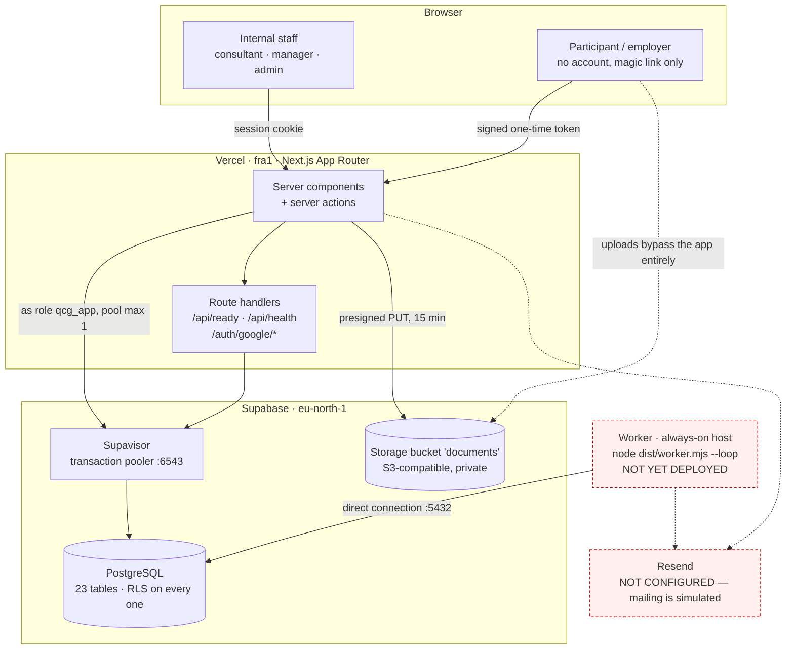
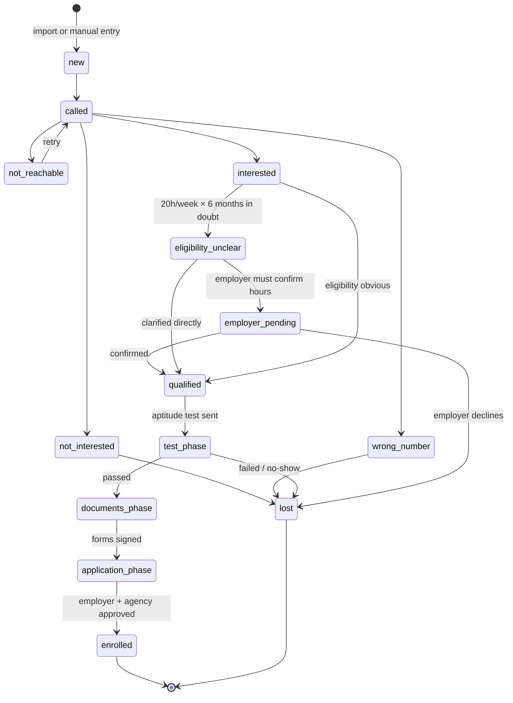
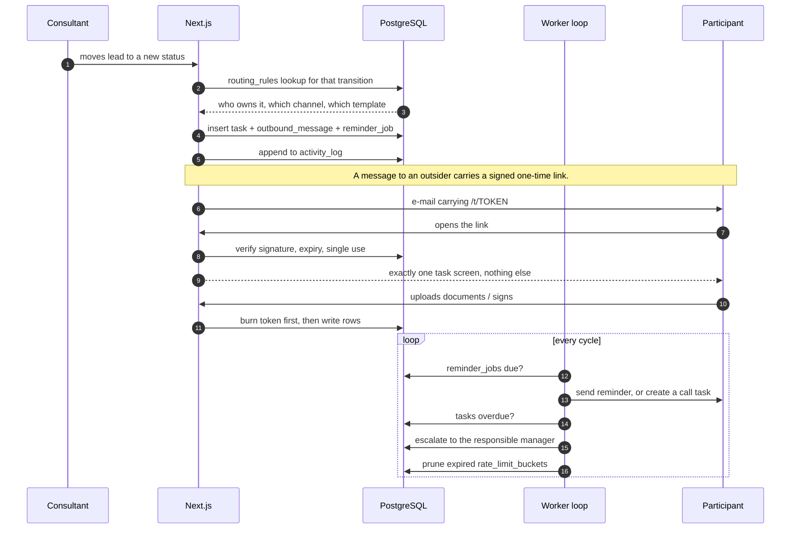
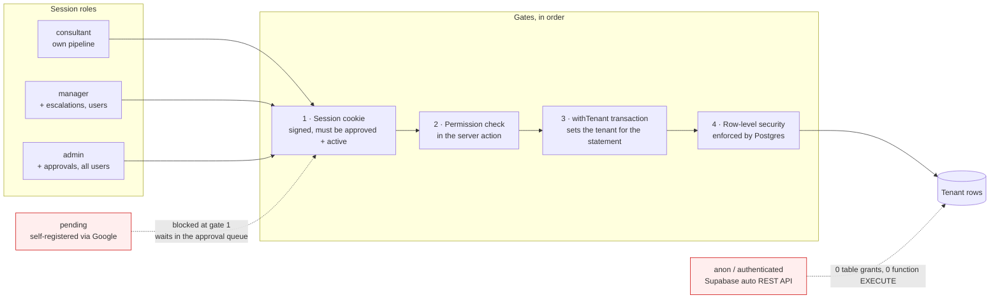

# System overview

Four views of the same system: where it runs, what it does to a lead, how work
gets chased without anyone watching, and who is allowed to see what. Together
they are meant to answer the questions a reviewer asks first — what breaks if
this box dies, and what stops tenant A from reading tenant B.

---

## 1. Deployment

What actually runs, as of the first production deploy.

**Why the pool is capped at one.** Serverless inverts the usual assumption:
there is no single pool, there is one per live instance. Ten connections each
exhausts Postgres long before real load does, so each function holds one and
Supavisor multiplexes them onto real backends.

**Why uploads skip the app.** A Vercel request body is capped at 4.5 MB and a
scanned ID is regularly larger. The server signs a URL for one object — with the
content type and exact byte count inside the signature — and the browser PUTs
straight to the bucket. The app only learns about the file afterwards, reads the
bytes back, and verifies they really are a PDF or an image before filing
anything.

**The two red boxes are real gaps.** Without the worker nothing is chased: no
reminder fires and no task escalates. Without Resend credentials every message
is written to the outbox and marked simulated instead of leaving the building.
Both are configuration, not code.

---

## 2. What happens to a lead

The participant status enum, as the pipeline actually moves.

The gate that shapes everything is availability: 20 hours a week for six months.
`employer_pending` exists because that answer usually is not the participant's
to give — it depends on their employer agreeing to a time model, which is why
employers are a first-class entity with their own status list rather than a text
field on the participant.

---

## 3. How work gets chased

The part that makes it a system rather than a spreadsheet: a state change
creates a task, a task that goes unanswered chases itself, and an external
person can act without ever holding an account.

**The token is the whole external surface.** No accounts for participants or
employers: a link scoped to one task, expiring, single use, and burnt before any
write happens so a double submit cannot produce two rows.

**Templates and routing rules are data.** A tenant without those 26 rules and 42
templates looks perfectly healthy and silently never chases anyone — which is
why bootstrapping them is a deployment step, not a seed script for demos.

---

## 4. Who can see what

**Four gates, and the last one is not ours.** Application code decides what to
ask for; Postgres decides what may be returned. The app connects as `qcg_app`, a
role that owns nothing, so a missed `where tenant_id = …` returns no rows rather
than someone else's. That is the difference between a bug and a breach.

**Signing in with Google grants nothing by itself.** Anyone can create a row;
the row lands as `pending` and only an admin can move it to `approved`. Two
things bound the abuse: an address is only matched inside the tenant a
registration would join, so a Google account cannot be linked into a tenant it
was never invited to, and the pending queue is capped so it cannot be filled all
afternoon.

**The Supabase REST API is closed.** Supabase exposes `public` over PostgREST to
the `anon` role by default; a hardening migration revokes every table grant and
every function EXECUTE, so the database is reachable only through the app.
